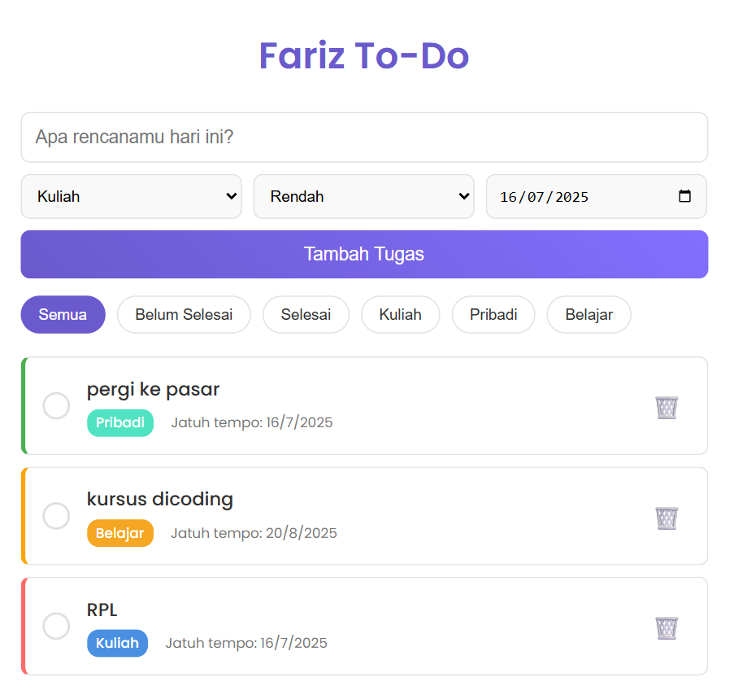

# ToDoApp

Aplikasi To-Do List ini adalah proyek front-end yang saya bangun untuk mempraktikkan dan mendemonstrasikan kemampuan dasar pengembangan web. Proyek ini dirancang untuk membantu pengguna mengelola tugas harian secara efisien dengan berbagai fitur canggih. Aplikasi ini dibangun murni menggunakan HTML, CSS, dan JavaScript tanpa bantuan framework, untuk menunjukkan pemahaman yang kuat pada teknologi inti web.

### Fitur Utama
Manajemen Tugas (CRUD)
Pengguna dapat menambah, melihat, memperbarui status (selesai/belum selesai), dan menghapus tugas.

### Kategorisasi & Prioritas
Setiap tugas dapat diberi label kategori (misalnya Kuliah, Pribadi) dan tingkat prioritas (Tinggi, Sedang, Rendah) untuk organisasi yang lebih baik.

### Tanggal Jatuh Tempo
Pengguna dapat menetapkan tanggal jatuh tempo untuk setiap tugas agar tidak ada tenggat waktu yang terlewat.

### Filter Dinamis
Tugas dapat disaring secara langsung berdasarkan status (Semua, Selesai, Belum Selesai) atau berdasarkan kategori.

### Penyimpanan Lokal
Aplikasi ini menggunakan localStorage browser untuk menyimpan data, sehingga daftar tugas tidak akan hilang meskipun halaman ditutup atau dimuat ulang.

### Desain Responsif & Modern
Tampilan antarmuka (UI) dirancang agar bersih, modern, dan dapat beradaptasi dengan baik di berbagai ukuran layar.

## Teknologi yang Digunakan
### HTML5
Untuk membangun struktur konten yang semantik dan rapi.

### CSS3
Untuk styling dan layout, dengan memanfaatkan fitur modern seperti Flexbox, Grid Layout, dan Custom Properties (Variables) untuk tema yang konsisten.

### JavaScript (ES6+)
Untuk semua logika aplikasi, termasuk manipulasi DOM, event handling (interaksi pengguna), dan pengelolaan data melalui Web Storage API (localStorage).
